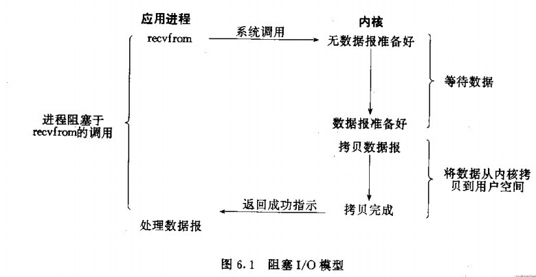

#读python网络编程笔记

##第一章

##第二章
1 python 的socket 模块定义了4种可能出现的异常

 * 与一般I/O和通信有关的socket.error;
 * 与查询地址信息有关的socket.gaierror;
 * 与其他地址错误有关的socket.herror
 * 与在一个socket上调用settimeout()后，处理超时有关的socket.timeout

? shutdown()和close()

##第三章
1. 网络协议及其对应端口号在/etc/services里面定义
2. inetd
3. python struct pack : 对字符串处理二进制。 H 适用于16位/I 32; !表示适用网络字节顺序来进行编码和解码(见第五章5.4)
4. hup信号 kill -HUP pid #让pid进程重新启动
5. syslog
6. 避免死锁
当服务器和客户端都停下来等候一个行为出现的时候，有可能会出现死锁.小心地设计协议并适当地使用超时，可以减小死锁出现的频率和影响   
7. traceback

##第四章域名系统
1. unix 系统包含一个/etc/hosts文件，定义了主机名和IP地址

##第五章高级网络操作
1. 半开放socket :shutdown
2. 设置超时:调用socket的settimeout()
3. 网络字节顺序
当在网络上发送整型数据时，有两种选择
 * 一个ASCII嘛的字符串
 * 一个二进制字
网络字节顺序：一种标准的二进制数据表示方法
struct pack unpack
4. 适用广播数据
5. 使用poll()或者select()实现事件通知

##第六章Web客户端访问
1. http 验证: urllib2.HTTPBasicAuthHandler
2. 提交表单数据:post/get;urllib.usrlencode();捕获连接错误,URLError,HTTPError(HTTPError可以read());捕获数据错误

##第七章解析HTML和XHTML
先跳过

##第八章XML和XML-RPC
先跳过
XML-RPC:http://zh.wikipedia.org/wiki/XML-RPC

##第九章E-mail的编写和编码
mail:header和body
理解MIME概念:
添加MIME附件
MIME替换方法
构建非英语的header
解析邮件

##第十章简单邮件传输协议
初始化/连接的时候注意要设置端口
错误处理与会话调试
邮件大小限制;HELO/EHLO
使用SSL和TLS
认证;login()

##第11章 POP
1. POP3 不能作为邮件同步的协议
2. 连接一个POP服务器可能会把邮箱绑定。所以，应该尽快操作POP,并在结束的时候调用quit()

##第12章IMAP
跳过

##第13章FTP
具体细节跳过

##第14章数据库客户端
调用commit()提交到磁盘才能实现真正改变
事务可以把多条对数据库的改动放到一条命令中
executemany()
得到数据fetchall()/fetchmany()/fetchone()
阅读Metadata
使用数据类型：DB-API可以把python数据转化为适合SQL语句的参数

##第15章 SSL
1. 理解网络弱点;各种攻击方法
2. SSL 使用公共密钥的加密术
3. 使用内置的SSL/openssl
3. 使用openssl验证服务器证书
set_verify(mode, callback)  //callback 怎么运行的 ？

##第16章SocketServer
1. 使用BaseHTTPServer;请求文件;
同时处理多个请求: forking/thread/nonblocking通信
2. SimpleHTTPServer
3. CGIHTTPServer: 能够运行所停工的文件中的CGI脚本程序
4. 实现新协议

##第17章SimpleXMLRPCServer
1. 使用SimpleXMLRPCServer
2. 使用DocXMLRPCServer
3. 使用CGIXMLRPCRequestHandler
4. 支持Multical函数:可以使客户端一次向XML-RPC服务器提交多个请求

##第18章CGI
CGI: 公用网关接口
使用python编写CGI:取得环境信息
取得输入:额外的URL成分/GET/POST
转义特殊字符
处理一个字段的多个输入
Cookie

##第19章mod_python
跳过

##第20章forking
1. 理解进程:进程是多任务处理的基本单元
2. folk(): 返回针对原始(父)进程而产生新进程的PID。对于新(子)进程，它返回PID 0
3. forking副作用
	1. 重复的文件描述符;
	2. zomebie进程：子进程终止，父进程还未准备好整理;
 		* 用信号解决zombie问题:signal.signal(signal.SIGCHLD, chlhandler)
 		* 使用轮询来解决zombie问题
4. foking 服务器
子进程结束时调用sys.exit(0)
5. 锁定:控制存取文件的常用方法;
共享锁/独占锁
6. 错误处理;
fork()失败，则关闭客户端的socket

##第21章线程
1. 使用共享变量;安全线程:Lock acquire()/release();信号量;避免死锁
2. 编写含有线程的服务器
	1. 使用线程池:
	 * listen()监听连接,并调用handleconnection()进行处理
 	 * handleconnection()处理连接，当没有可用的线程则开启一个新线程。接加入队列，并relsease()信号量
	 * threadwork() 线程的target。负责将先有线程加入waitinglist,并调用proclient(), 然后在finally部分将死去的线程清除，并开启一个新线程
 	 * 循环处理任务，通过acquire()信号量监听，从队列中获得新连接任务，设置wai	tinglist和busilist,然后处理连接。
3. 含有线程的客户端
  Condition有一个潜在的锁。调用wait()会释放锁并等待另外一个进程调用notify(),但它总是在返回前再次请求锁。

##第22章异步通信
1. buffers保存每个客户端的buffer, socket保存每个客户端的socket;保存一个poll()对象.
每个连接在poll对象中注册,说明对读还是写感兴趣;主程序在循环的顶部调用self.p.poll(),它为程序中被期望阻滞的调用
2. 阻塞型和非阻塞型socket

3. 监听多个master socket
  手动实现inet;同时使用polling和forking
4. 在服务器上使用Twisted
